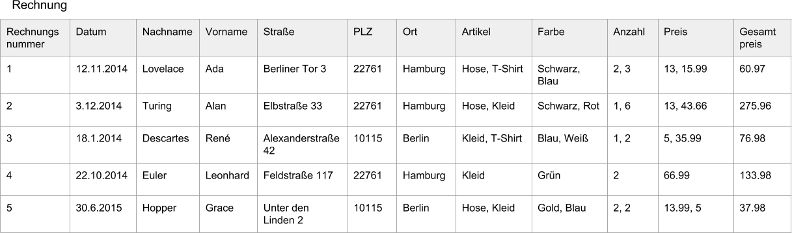

# Aufgabenzettel 4

Abgabe: _19.11._ bzw. _26.11._

[Hinweise für die Abgabe](https://github.com/klyrr/lecture/blob/master/2015/haw/db/README.md)

## Aufgaben 4.1

Bringen Sie die Tabelle `Rechnung` in 3NF und vergeben Sie für eventuell neu entstehende Tabellen entsprechende Namen.

## Aufgaben 4.2

Finden Sie mindestens 5 funktionale Abhāngigkeiten und leiten Sie aus diesen mit Hilfe der Armstrongschen Axiome 3 weitere her.

## Aufgabe 4.3

Am Ende der 04. Vorlesung wurden die `CREATE TABLE` Anweisungen vorgestellt. Schreiben Sie die Anweisungen für die von Ihnen in 4.1. erstellten Tabellen.

Denken Sie an die Datentypen der Spalten und eventuelle Primār- und Fremdschlüssel.
